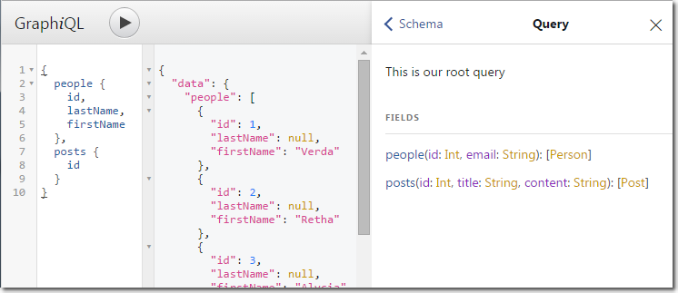

# GQL2SQL API Service

> Under Development!!!

This node application, once completed, will serve as an API service in front of our main SQL database (mainly for Findur data).
It can be used by any other applications or processes to interact with the Findur database without having to write complex SQL queries over unknown Findur-specific tables.

## Installation / Development

**Prerequisites:**

* Install Git
* Install Node.js
* Install Babel

**Installation:**

1. Clone this repo
2. Install dependencies: `npm install`
3. Run the service: `babel-node server.js`

Feel free to submit pull requests for enhancements. There is lots to do!

## Schema / Models

Currently only two basic example models exist to have something to start development with:

* People
* Posts

## Abstraction

GraphQL is used as an efficient abstraction layer to read from or write to the MSSQL database, based on pre-defined SQL definitions.
Whether an API endpoint represents a single small reference table, or a large number of tables, modelled by complex SQL constructs... the GraphQL access will remain both simple and efficient.

It is also secure from SQL Injection, as no direct SQL will be used by the clients connecting via this service.

## TODOs

| Backlog | In Progress | Done  |
| --------|---------|-------|
|         |         | Connect with MSSQL |
|         |         | Add GraphiQL IDE |
|         |         | Add example models |
|         |         | Use Sequalize ORM |
|         |         | Central Config file |
|         | Single User Table Schema  |   |
| Forecasts Schema |         |       |
| Service Authentication |         |       |
| Automatic Model Config |         |       |
| Logging |         |       |
| Documentation |         |       |
| Process Runner/Cluster |         |       |
| Deployment Instructions |         |       |
| Standard Transaction Schema|         |       |
| Tradeflows Schema |         |       |
| Rates Schema |         |       |
| ??? |         |       | |

...
