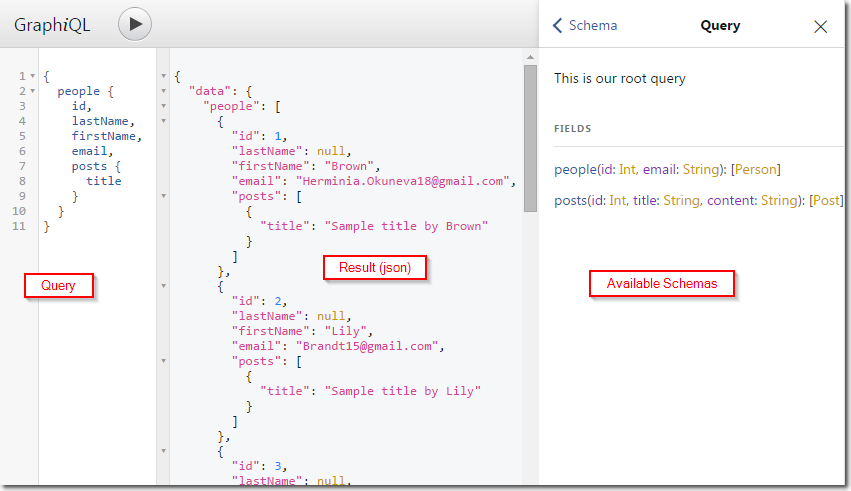

# GQL2SQL API Service

This simple node app serves as example of a GraphQL API service in front of a legacy SQL database.
It shows usage of Sequelize to interact with a MSSQL database (never need to write a single SQL command), and some tooling like:

* Babel (full ES6, incl. imports for example)
* Logging with Winston (console and Loggly)
* Testing with Mocha and Chai
* Linting (ESLint)

## Installation / Development

**Prerequisites:**

* [Git](https://git-scm.com/)
* [Node.js](https://nodejs.org/en/)
* [Babel](https://babeljs.io/docs/usage/cli/)

**Installation:**

1. Clone this repo
2. Install dependencies: `npm install`
3. Run the service: `npm start`

Feel free to submit pull requests for enhancements!

**Testing:**

1. `npm test` will run any tests in the `test` folder

## Schema / Models

Currently only a generic model of "Items" has been implemented. It can serve as a guide to add more models to expose (both in Sequelize and GraphQL).

## GraphQL and Sequelize

GraphQL is used as an efficient *abstraction layer* to read from or write to the MSSQL database, based on pre-defined data *schemas*. Unlike with REST APIs, with GraphQL you retrieve only what you query for, parameterized and fast.
The response is always valid JSON, which makes working with the returned data very easy in most languages.

Behind the scenes, the SQL endpoints are managed by the [**Sequelize** ORM](http://docs.sequelizejs.com/), in order to abstract away from manually constructed SQL statements. Sequelize takes care of security, data type validations and transaction management when accessing the SQL back-end.

Btw, using the combination of GraphQL with a SQL ORM, the API Service is also secure from SQL Injection, which is neat.

## TODOs

| Backlog | In Progress | Done  |
| --------|---------|-------|
|         |         | Connect with MSSQL |
|         |         | Add GraphiQL IDE |
|         |         | Use Sequalize ORM |
|         |         | Central Configuration |
|         |         | Items Schema |
| Service Authentication |         |       |
| |         | Logging (Winston -> Loggly)|
|  | | Test examples |
|  | | Process Runner/Cluster |
| Change to Apollo Tools |         |       | |

...
